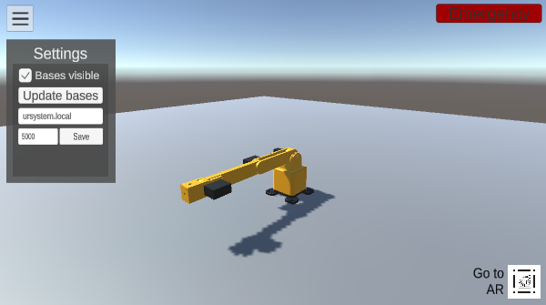
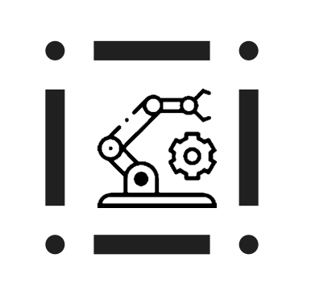

</img>

# Информация

</img>

Проект представляет собой симуляцию первого робота
который работает на системе управления [URSystem](https://github.com/MrBrain-YT/URSystem),
Также поддерживает работу с дополненной реальностью через vuforia. Для работы дополненной реальности
требуется метка 

</img>
&nbsp;
<h3>&nbsp;</h3>

# Параметры

**IP** - ip адресс системы управления URSystem (По стандарту `ursystem.local`)

**PORT** - порт системы управления URSystem (По стандарту `5000`)

# Ссылки

[**URSystem**](https://github.com/MrBrain-YT/URSystem) - система управления роботами

[**URLanguage**](https://github.com/MrBrain-YT/URLanguage) - Библиотека для администрирования системы управления и управления роботами